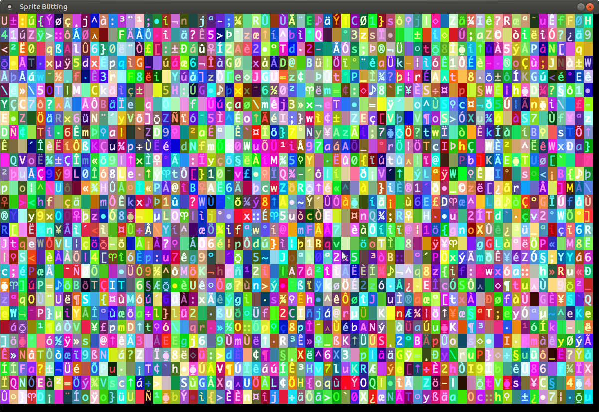

# sprite-blitting

A D language program, using Derelict3, that demonstrates how to
perform sprite blitting from a spritesheet to the screen.

To use:

1. Install D and dub.
2. Clone this repo
3. Inside the repo, run 'dub'.

